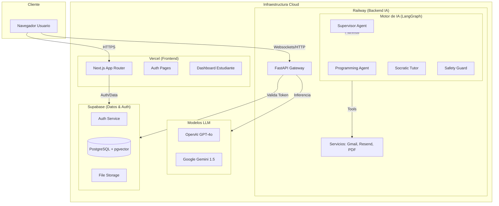
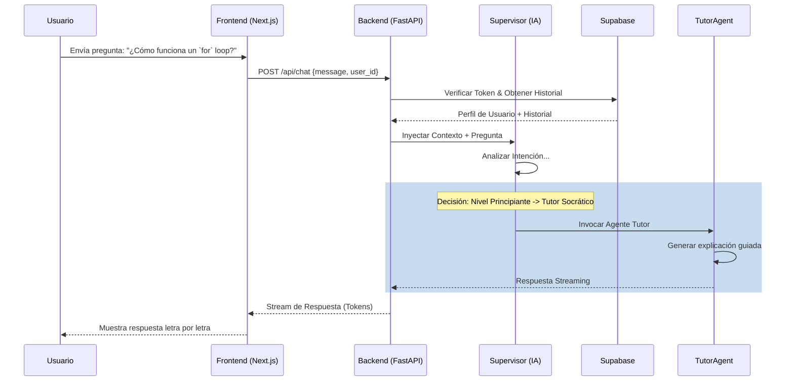
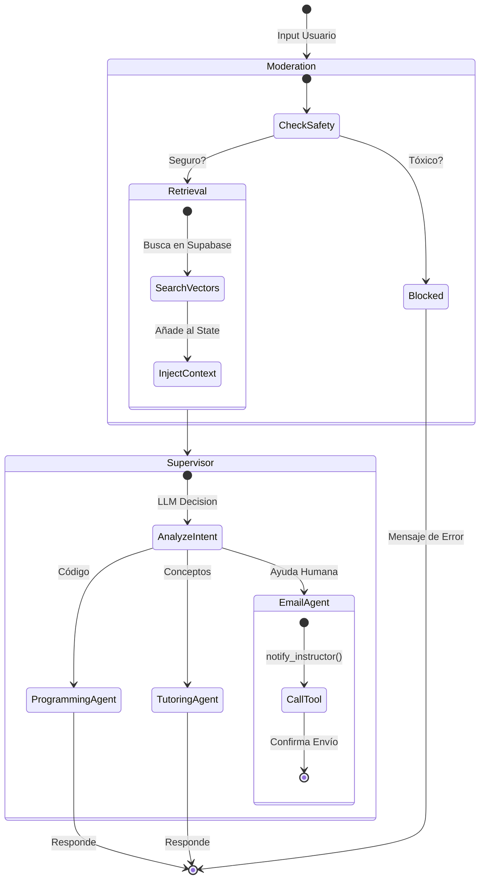

# 🚀 Sistema Iron Makers

Bienvenido a la documentación oficial del **Sistema Iron Makers**. Esta plataforma es un ecosistema educativo avanzado que fusiona un frontend moderno (Next.js) con un backend de Inteligencia Artificial (FastAPI + LangChain).

El sistema no solo entrega contenido educativo, sino que actúa como un tutor personalizado que entiende el contexto del estudiante, modera el contenido por seguridad y asiste en tareas de programación compleja.

---

## 🎥 Demo del Funcionamiento

[](https://www.youtube.com/watch?v=vcGux2oKRWc)

*Haz clic en la imagen para ver el video de demostración.*

---

## 📚 Índice

1. [Arquitectura Global](#-arquitectura-global)
2. [Flujo de Datos & Interacción](#-flujo-de-datos--interacción)
3. [Componentes del Sistema](#-componentes-del-sistema)
    - [Frontend (Blog Educativo)](#frontend-blog-educativo)
    - [Backend (IA & Lógica)](#backend-ia--lógica)
4. [Deep Dive: Arquitectura de IA](#-deep-dive-arquitectura-de-ia-backend)
    - [El Grafo (LangGraph)](#1-el-grafo-langgraph)
    - [Sistema de Ruteo (Supervisor)](#2-sistema-de-ruteo-supervisor)
    - [Agentes Especializados](#3-agentes-especializados)
    - [Pipeline RAG (Contexto)](#4-pipeline-rag-contexto)
5. [Guía de Instalación Local](#-guía-de-instalación-local)
6. [Guía de Despliegue (Producción)](#-guía-de-despliegue-producción)

---

## 🏛 Arquitectura Global

El sistema opera bajo una arquitectura de **Microservicios Híbridos**. El frontend es estático/ISR (Incremental Static Regeneration) optimizado para rapidez, mientras que el backend es un servicio API RESTful dinámico que mantiene estado conversacional a través de grafos de LangChain (LangGraph).



---

## 🔄 Flujo de Datos & Interacción

### ¿Cómo interactúa el Frontend con el Backend?

El Frontend no "piensa", solo presenta. Cuando un usuario hace una pregunta compleja en el chat:

1.  **Frontend**: Captura el input del usuario y lo envía al endpoint `/chat` del Backend.
2.  **Backend (FastAPI)**: Recibe la solicitud, valida la identidad del usuario con Supabase Auth.
3.  **Supervisor (LangGraph)**: Analiza la intención. ¿Es una duda de código? ¿Es una pregunta conceptual?
4.  **Enrutamiento**:
    *   Si es código -> Activa **Programming Agent**.
    *   Si es concepto -> Activa **Socratic Tutor**.
    *   Si es peligroso -> Activa **Safety System**.
5.  **Respuesta**: El agente genera una respuesta (streaming) que FastAPI devuelve al Frontend en tiempo real.



---

## 🧩 Componentes del Sistema

### Frontend: Blog Educativo (`/blog`)

Construido con las últimas tecnologías para garantizar rendimiento y SEO.

*   **Next.js 16**: Utiliza Server Components para renderizar el blog super rápido.
*   **Supabase Client**: Maneja la sesión del usuario (Login con Google/GitHub mágico).
*   **Mermaid.js & KateX**: Renderiza diagramas y ecuaciones matemáticas en tiempo real dentro del chat y los artículos.

### Backend: IA & Lógica (`/backend_python_ia`)

El cerebro real. No es solo una API CRUD.

*   **FastAPI**: Maneja las conexiones HTTP y Websockets de baja latencia.
*   **LangGraph**: Permite crear flujos de conversación cíclicos (Loop: Pensar -> Actuar -> Observar -> Responder).
*   **Servicios**: Módulos aislados para enviar correos (Gmail/Resend) o procesar archivos (PDFPlumber).

---

## 🧠 Deep Dive: Arquitectura de IA (Backend)

Aquí es donde ocurre la magia. El sistema no utiliza una sola cadena de "Prompt Engineering", sino una **Máquina de Estados Finita (State Graph)** orquestada por `LangGraph`.

### 1. El Grafo (LangGraph)

El grafo define el ciclo de vida de cada mensaje del usuario.



**Explicación de Nodos:**
*   `Moderation`: Utiliza OpenAI moderations API + filtros personalizados para detectar grooming, suicidio o violencia antes de procesar nada.
*   `Retrieve`: Realiza una búsqueda semántica (Embeddings) en Supabase para encontrar documentos PDF/Clases relevantes a la pregunta.
*   `Supervisor`: Decide quién atiende la consulta.

### 2. Sistema de Ruteo (Supervisor)

Ubicado en `app/core/supervisor_agent.py`, utiliza un Prompt de Sistema Clasificador.

*   **Input**: *"Mi código Python tira error en la línea 5"*
*   **Lógica**:
    1.  Extrae texto (si hay imágenes).
    2.  Ejecuta `route_by_llm`: Un LLM pequeño clasifica la intención en `PROGRAMMING`, `TUTORING` o `EMAIL`.
    3.  Devuelve el siguiente nodo del grafo.

### 3. Agentes Especializados

Cada agente tiene una "Personalidad" instanciada un prompt de sistema único y acceso a herramientas específicas.

#### A. Programming Agent (`app/agents/programming_agent.py`)
*   **Prompt**: "Eres un experto en Python, C++ y Arduino. Tu objetivo es hacer debugging y explicar errores."
*   **Comportamiento**: Analiza stack traces, sugiere correcciones de sintaxis y da ejemplos de código. NO da solo la solución, explica el *por qué*.

#### B. Socratic Tutor (`app/agents/tutoring_agent.py`)
*   **Prompt**: "Eres un educador Socrático. NO des la respuesta directa. Guía al estudiante con preguntas."
*   **Adaptabilidad**: Ajusta su vocabulario basado en la edad del usuario (extraída de Supabase).

#### C. Email Agent (`app/agents/email_agent.py`)
*   **Función**: Puente con humanos.
*   **Herramientas**: Tiene acceso exclusivo a `notify_instructor`.
*   **Trigger**: Se activa si el usuario dice "Necesito ayuda humana" o "Contacta al profesor".

### 4. Pipeline RAG (Contexto)

El sistema utiliza **RAG (Retrieval-Augmented Generation)** para que la IA sepa sobre el contenido del curso.

1.  **Ingesta**: Los documentos del curso se dividen en chunks y se vectorizan (OpenAI Embeddings).
2.  **Almacenamiento**: Se guardan en Supabase (`pgvector`).
3.  **Consulta**:
    *   En el nodo `retrieve`, la pregunta del usuario se vectoriza.
    *   Se hace una búsqueda de similitud coseno en Supabase (`match_documents` RPC).
    *   Los chunks más relevantes se inyectan en el `AgentState` bajo la clave `context`.

---

## 🛠 Guía de Instalación Local

### Prerrequisitos
*   Node.js 18+
*   Python 3.10+
*   Cuenta en Supabase y OpenAI/Google AI.

### Paso 1: Configurar Backend (Puerto 8000)

1.  Entra a la carpeta: `cd backend_python_ia`
2.  Crea entorno virtual:
    ```bash
    python -m venv venv
    source venv/bin/activate  # (Windows: venv\Scripts\activate)
    ```
3.  Instala librerías: `pip install -r requirements.txt`
4.  Crea `.env` con tus llaves:
    ```env
    OPENAI_API_KEY=sk-...
    SUPABASE_URL=https://xyz.supabase.co
    SUPABASE_KEY=ey...
    ```
5.  Corre el servidor: `uvicorn main:app --reload`

### Paso 2: Configurar Frontend (Puerto 3000)

1.  Entra a la carpeta: `cd blog`
2.  Instala dependencias: `npm install`
3.  Crea `.env.local`:
    ```env
    NEXT_PUBLIC_SUPABASE_URL=...
    NEXT_PUBLIC_SUPABASE_ANON_KEY=...
    NEXT_PUBLIC_API_URL=http://localhost:8000
    ```
4.  Corre la app: `npm run dev`

---

## 🚀 Guía de Despliegue (Producción)

### Desplegar Backend en Railway 🚂

1.  Sube tu repo a GitHub.
2.  Importa el repo en Railway.
3.  Configura el **Root Directory** en `/backend_python_ia`.
4.  Configura el **Start Command**: `uvicorn main:app --host 0.0.0.0 --port $PORT`.
5.  Variables clave: `OPENAI_API_KEY`, `SUPABASE_URL`, `GMAIL_CREDENTIALS_JSON`.

### Desplegar Frontend en Vercel ▲

1.  Importa el repo en Vercel.
2.  **Framework Preset**: Next.js.
3.  **Root Directory**: `blog`.
4.  Variables: `NEXT_PUBLIC_SUPABASE_URL`, `NEXT_PUBLIC_API_URL` (URL de Railway).
5.  Deploy.

---

## 👨‍💻 Autor

Este proyecto fue creado y es mantenido por:

**José Ángel Balbuena Palma**  
[](https://www.linkedin.com/in/jose-angel-balbuena-palma-52279a177/)

---

**Sistema Iron Makers** v4.0 - Documentación Técnica Avanzada.
