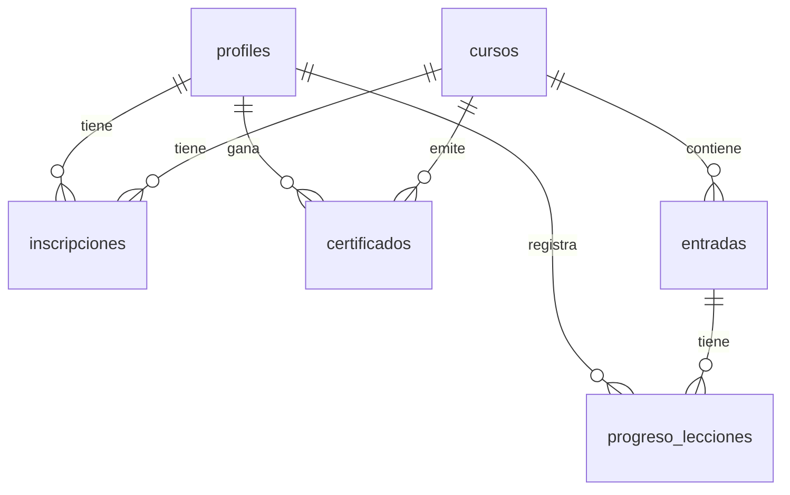

# 🎓 Blog Educativo - Sistema de Cursos Online

Sistema completo de gestión de cursos educativos con autenticación, tracking de progreso, generación automática de certificados y panel de administración. Este proyecto está diseñado para ofrecer una experiencia de aprendizaje moderna y fluida, tanto para estudiantes como para administradores.

## 📋 Características Principales

### Frontend Público
- 🏠 **Landing Page Dinámica**: Contenido totalmente personalizable desde la base de datos (secciones, equipo, proyectos).
- 📚 **Catálogo de Cursos**: Navegación intuitiva de cursos disponibles con filtrado y búsqueda.
- 📖 **Visualizador de Lecciones**: Renderizado de contenido rico soportando:
  - Bloques de texto con formato enriquecido.
  - **Código**: Syntax highlighting para múltiples lenguajes (Python, JS, TS, etc.).
  - **Matemáticas**: Renderizado de fórmulas LaTeX con KaTeX.
  - **Multimedia**: Imágenes y videos (YouTube/Vimeo) embebidos.
- 📊 **Tracking de Progreso**: Sistema granular de seguimiento por lección.
- 🏆 **Certificados Automáticos**: Generación de PDF verificable al completar el 100% del curso.
- 👤 **Panel de Usuario**: Dashboard personal con cursos inscritos, progreso y certificados obtenidos.

### Panel de Administración
- 📈 **Dashboard**: Métricas en tiempo real de usuarios, inscripciones y cursos.
- ✏️ **Gestión de Cursos**: CRUD completo para cursos y lecciones.
- 📝 **Editor de Contenido**: Editor basado en bloques JSONB para crear lecciones interactivas.
- 👥 **Gestión de Usuarios**: Visualización de usuarios registrados.

### Seguridad y Autenticación
- 🔐 **Supabase Auth**: Sistema robusto de autenticación (Email/Password).
- 🛡️ **Row Level Security (RLS)**: Protección de datos a nivel de fila en PostgreSQL.
- 👮 **Roles**: Sistema de roles (admin/user) gestionado en la tabla `profiles`.
- 🚪 **Middleware**: Protección de rutas en Next.js basado en roles.

---

## 🚀 Tecnologías

### Core
- **Framework**: [Next.js 16](https://nextjs.org/) (App Router)
- **Lenguaje**: [TypeScript 5.9](https://www.typescriptlang.org/)
- **Estilos**: [Tailwind CSS 3](https://tailwindcss.com/)

### Backend & Datos
- **Base de Datos**: [Supabase](https://supabase.com/) (PostgreSQL)
- **Autenticación**: `@supabase/ssr` & `@supabase/supabase-js`
- **Almacenamiento**: Supabase Storage (para imágenes y certificados)

### Renderizado & Utilidades
- **PDF**: `@react-pdf/renderer` para generación de certificados.
- **Código**: `react-syntax-highlighter`.
- **Matemáticas**: `katex` y `react-katex`.
- **Markdown**: `react-markdown` y `remark-gfm`.

---

## 🗄️ Base de Datos y Schema

El proyecto utiliza una base de datos PostgreSQL alojada en Supabase. El esquema está diseñado para ser escalable y seguro.

### Tablas Principales

1.  **`profiles`**: Extensión de la tabla `auth.users`. Almacena información pública del usuario (nombre, avatar, rol).
2.  **`cursos`**: Catálogo de cursos (título, slug, descripción, portada).
3.  **`entradas`** (Lecciones): Contenido de las lecciones. Relacionada con `cursos`. Usa un campo `JSONB` para el contenido modular.
4.  **`inscripciones`**: Tabla pivote que registra qué usuarios están inscritos en qué cursos y su estado (inscrito/completado).
5.  **`progreso_lecciones`**: Tracking granular. Registra si un usuario ha completado una lección específica.
6.  **`certificados`**: Almacena los certificados emitidos. Contiene el código de verificación único y la URL del PDF.

### Tablas de Contenido (Landing Page)
7.  **`contenido_landing`**: Textos dinámicos de la home.
8.  **`integrantes_equipo`**: Miembros del equipo mostrados en "Quiénes somos".
9.  **`proyectos_destacados`**: Portfolio de proyectos.

### Diagrama de Relaciones (Simplificado)


---

## ⚡ Supabase y Migraciones

El proyecto mantiene todo el esquema de base de datos y funciones en el directorio `/supabase`.

### Estructura de Archivos
- `supabase/schema.sql`: Definición base de todas las tablas.
- `supabase/policies.sql`: Políticas de seguridad RLS (Row Level Security).
- `supabase/triggers.sql`: Funciones automáticas (ej: crear perfil al registrarse, verificar completitud de curso).
- `supabase/seed.sql`: Datos de prueba iniciales.
- `supabase/migrations/`: Scripts de migración para cambios incrementales.

### Flujo de Migraciones
Para aplicar cambios a la base de datos, recomendamos usar el SQL Editor de Supabase o la CLI.

#### 1. Configuración Inicial
Si estás levantando el proyecto desde cero, ejecuta los scripts en este orden en el SQL Editor de Supabase:
1.  `schema.sql`
2.  `policies.sql`
3.  `triggers.sql`
4.  `storage-policies.sql`

#### 2. Aplicar Migraciones
Las migraciones se encuentran en `supabase/migrations/`. Por ejemplo, si necesitas agregar campos a `proyectos_destacados`, busca el archivo `.sql` correspondiente y ejecuta su contenido.

Ejemplo de migración (`add_proyectos_fields.sql`):
```sql
ALTER TABLE public.proyectos_destacados 
ADD COLUMN IF NOT EXISTS tecnologias TEXT[] DEFAULT '{}';
```

### Triggers Importantes
- **`handle_new_user`**: Se ejecuta automáticamente cuando un usuario se registra en Supabase Auth. Crea una entrada correspondiente en la tabla `public.profiles`.
- **`check_curso_completion`**: Se ejecuta cada vez que se actualiza `progreso_lecciones`. Verifica si el usuario ha completado todas las lecciones de un curso. Si es así:
    1.  Marca la inscripción como 'completado'.
    2.  Genera un registro en la tabla `certificados` con un código único.

---

## 📦 Instalación y Desarrollo

### Prerrequisitos
- Node.js 18+
- Cuenta en Supabase

### Pasos

1.  **Clonar el repositorio**
    ```bash
    git clone <url-del-repo>
    cd blog
    ```

2.  **Instalar dependencias**
    ```bash
    npm install
    ```

3.  **Configurar Variables de Entorno**
    Crea un archivo `.env.local` basado en `.env.example`:
    ```env
    NEXT_PUBLIC_SUPABASE_URL=https://tu-proyecto.supabase.co
    NEXT_PUBLIC_SUPABASE_ANON_KEY=tu-anon-key
    NEXT_PUBLIC_ADMIN_EMAIL=admin@ejemplo.com
    ```

4.  **Configurar Base de Datos**
    Ejecuta los scripts SQL mencionados en la sección "Supabase y Migraciones" en tu dashboard de Supabase.

5.  **Configurar Storage**
    Crea dos buckets públicos en Supabase Storage:
    - `imagenes`: Para portadas de cursos y assets.
    - `certificados`: Para almacenar los PDFs generados.

6.  **Iniciar Servidor de Desarrollo**
    ```bash
    npm run dev
    ```
    Visita `http://localhost:3000`.

---

## 📂 Estructura del Proyecto

```
blog/
├── app/                    # Next.js App Router
│   ├── (public)/          # Rutas públicas (Landing, Cursos)
│   ├── admin/             # Rutas protegidas de administración
│   ├── auth/              # Páginas de Login/Registro
│   ├── mis-cursos/        # Área privada del estudiante
│   ├── api/               # API Routes (Generación PDF, etc.)
│   └── layout.tsx         # Layout raíz
├── components/            # Componentes React reutilizables
│   ├── ui/                # Componentes base (Botones, Inputs)
│   ├── cursos/            # Componentes específicos de cursos
│   └── admin/             # Componentes del panel admin
├── lib/                   # Utilidades y configuración
│   ├── supabase/          # Clientes de Supabase (Client/Server)
│   └── utils.ts           # Helpers generales
├── supabase/              # SQL y Migraciones
│   ├── migrations/        # Scripts de cambios incrementales
│   └── ...                # Scripts base (schema, policies, etc.)
└── public/                # Assets estáticos
```

---

## 📄 Licencia

Este proyecto está bajo la Licencia MIT.
